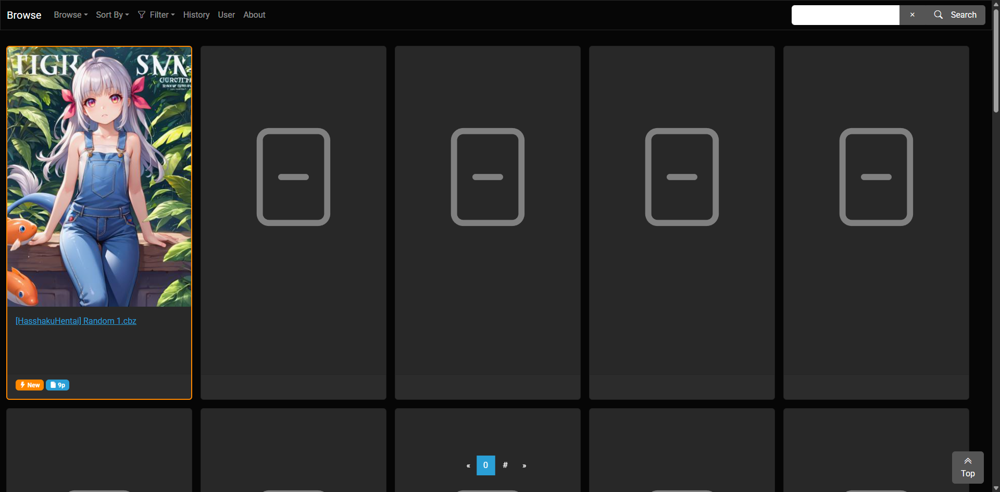

# MangaWeb 4

**MangaWeb 4** is a group of services providing manga reading experience right from the manga files without having to preprocess it. 

**MangaWeb 4** supports [OpenID Connect](https://openid.net/developers/how-connect-works/) provider for authentication (authorization is on the TODO list.). It's been tested with [Authentik](https://goauthentik.io/). Other providers might work, but use it at your own risk.

## 🚧🚧🚧 CAUTION 🚧🚧🚧

**MangaWeb 4** is still under heavy development. This README is also under construction. 

Contribution is welcome of course.

## Features

* Display comic files as is, no need to extract the files. 
* Support multi-user via OpenID Connect providers. 
* Populate tags from comic filename (any text within `[]` will be considered a tag).
* Flag comic as favorite.
* Flag tag as favoirte.
* Filter comic items based on favorite flag, favorite tag, or both.
* Sort items based on name, file creation date, or page count, both ascending and descending.
* Search comic by name

## Getting started

The easiest way to get **MangaWeb 4** up and running is via [Docker Compose](https://docs.docker.com/compose/). You can use clone the project [manga4-stack](https://github.com/mangaweb4/mangaweb4-stack), and run `$ docker compose up -d` to get it up and running. 

Once you get it up, visit `http://localhost:8000`, and you'll be greeted with the browse screen.

## Comic source files

**MangaWeb 4** mainly supports zip format (including *.zip and *.cbz), and a directory of image files for manga source. The supported image files are JPEG, PNG, and WebP. 

**MangaWeb 4** does not make changes to the source files, nor extract images and put it on some other storage. This makes it perfect for archiving the comic file as is. As the trade-off it might not be performant enough for public uses. 

## Updating library

**MangaWeb 4** does not update its library automatically, instead it offer a command under **Maintenance** section in the **About** page. 

**MangaWeb 4** also has `/api/maintenance/update_libary` API for updating the library. This requires `Authentication` HTTP request header with `Bearer <Access Token>` where the access token is taken from OIDC provider (Authentik, for example). I personally have it called hourly by an [Apache Airflow](https://airflow.apache.org/) instance. You could archive the samething with some other tools such as [N8N](https://n8n.io/) for example. 

## Copyright Notice

**MangaWeb 4** only includes tested comic files with the project. The comics appear in the screenshot are not shipped with the project. Each comics are protected by copyright owns by its rightful copyright holder. The developer does not claim to own the copyright of any of the comic shown here.

<!--

**Here are some ideas to get you started:**

🙋‍♀️ A short introduction - what is your organization all about?
🌈 Contribution guidelines - how can the community get involved?
👩‍💻 Useful resources - where can the community find your docs? Is there anything else the community should know?
🍿 Fun facts - what does your team eat for breakfast?
🧙 Remember, you can do mighty things with the power of [Markdown](https://docs.github.com/github/writing-on-github/getting-started-with-writing-and-formatting-on-github/basic-writing-and-formatting-syntax)
-->
